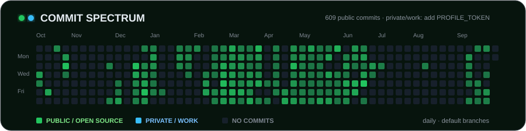
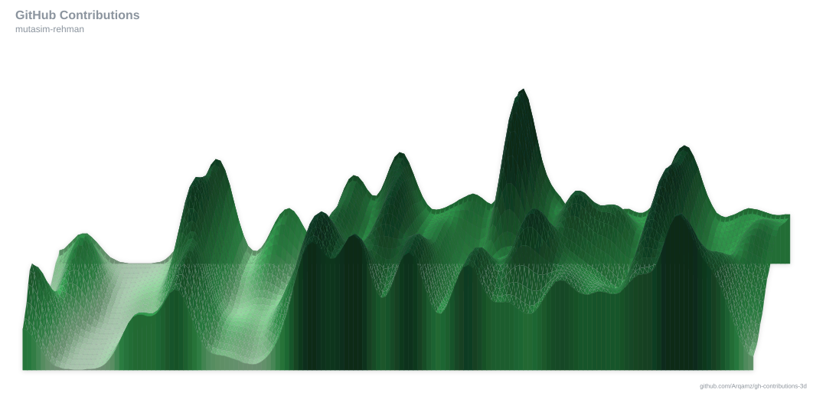

<div align="center">
  
</div>

<p align="center">
  <a href="https://www.linkedin.com/in/mutasim-ur-rehman"></a>
  <a href="mailto:motasimurrehman565@gmail.com"></a>
  <a href="https://instagram.com/mutasim-rehman"></a>
  
</p>

## Hello, world — I'm Mutasim 👋

I am a computer science student majoring in **data science**, building where artificial intelligence, interactive 3D, robotics, and scientific curiosity meet. I like projects that begin with a strange question and end as something you can see, use, or explore.

```text
current coordinates  →  multi-agent systems · generative AI · visual computing
favorite terrain     →  ambitious prototypes with a strong visual identity
guiding principle    →  bring unusual ideas to life
```

## Selected expeditions

<table>
  <tr>
    <td width="50%" valign="top">
      <h3>🏙️ <a href="https://github.com/mutasim-rehman/git-city">Git City</a></h3>
      <p>A multiplayer city built from developer activity—drive, explore, and complete quests inside a living GitHub world.</p>
      <p><code>TypeScript</code> <code>3D Web</code> <code>Multiplayer</code></p>
      <a href="https://git-pakistan.vercel.app"><b>Enter the city ↗</b></a>
    </td>
    <td width="50%" valign="top">
      <h3>🧠 <a href="https://github.com/mutasim-rehman/project-agere">Project Agere</a></h3>
      <p>Researching whether teams of small full-precision models can outperform a larger quantized model under equal RAM and token budgets.</p>
      <p><code>Python</code> <code>Multi-agent AI</code> <code>Research</code></p>
      <a href="https://github.com/mutasim-rehman/project-agere"><b>Read the research ↗</b></a>
    </td>
  </tr>
  <tr>
    <td width="50%" valign="top">
      <h3>🧬 <a href="https://github.com/mutasim-rehman/neuroview-ai">NeuroView AI</a></h3>
      <p>3D brain MRI visualization with CNN-powered health prediction, volume rendering, and anomaly detection.</p>
      <p><code>PyTorch</code> <code>React</code> <code>Three.js</code> <code>Flask</code></p>
      <a href="https://neuroview-ai.vercel.app"><b>Launch NeuroView ↗</b></a>
    </td>
    <td width="50%" valign="top">
      <h3>🪐 <a href="https://github.com/mutasim-rehman/Solar-System">Solar System Explorer</a></h3>
      <p>An interactive cosmic tour with orbital mechanics, NASA textures, spacecraft models, and time controls.</p>
      <p><code>JavaScript</code> <code>Three.js</code> <code>WebGL</code> <code>NASA APIs</code></p>
      <a href="https://mutasim-rehman.github.io/Solar-System/"><b>Explore the universe ↗</b></a>
    </td>
  </tr>
  <tr>
    <td width="50%" valign="top">
      <h3>🤖 <a href="https://github.com/mutasim-rehman/jarvis">Jarvis</a></h3>
      <p>A cross-device AI assistant that understands commands and automates tasks across mobile, desktop, and web.</p>
      <p><code>Python</code> <code>AI Agents</code> <code>Automation</code></p>
      <a href="https://jarvis-labs.vercel.app"><b>Meet Jarvis ↗</b></a>
    </td>
    <td width="50%" valign="top">
      <h3>🌊 <a href="https://github.com/mutasim-rehman/flood-prediction-project">Flood Prediction</a></h3>
      <p>An end-to-end Pakistan flood-risk pipeline combining weather, terrain, time-series features, and XGBoost.</p>
      <p><code>Python</code> <code>XGBoost</code> <code>Geospatial Data</code></p>
      <a href="https://github.com/mutasim-rehman/flood-prediction-project"><b>Inspect the pipeline ↗</b></a>
    </td>
  </tr>
</table>

## Technology constellation

<p align="center">
  
</p>

<p align="center">
  
  
  
  
  
  
  
  
  
  
  
  
  
  
  
  
  
  
</p>

<div align="center">
  <sub>Languages · AI/ML · data science · 3D/web · robotics · creative tooling</sub>
</div>

## Commit spectrum

<div align="center">
  
</div>

<p align="center">
  
  
</p>

<details>
  <summary><b>Raise the terrain — 3D contribution landscape</b></summary>
  <br />
  <div align="center">
    
  </div>
</details>

## More things I have brought to life

`NASA near-Earth object tracker` · `Rubik's Cube solving robot` · `gesture-controlled games` · `financial prediction assistant` · `RAG-powered Sherlock Holmes characters` · `AI society simulator` · `codebase risk visualizer` · `audio transformation experiments` · `Chladni pattern simulation` · `micromouse robot`

<div align="center">
  <br />
  <i>“Somewhere, something incredible is waiting to be known.”</i>
  <br />
  <sub>Keep wondering. Keep building.</sub>
</div>
